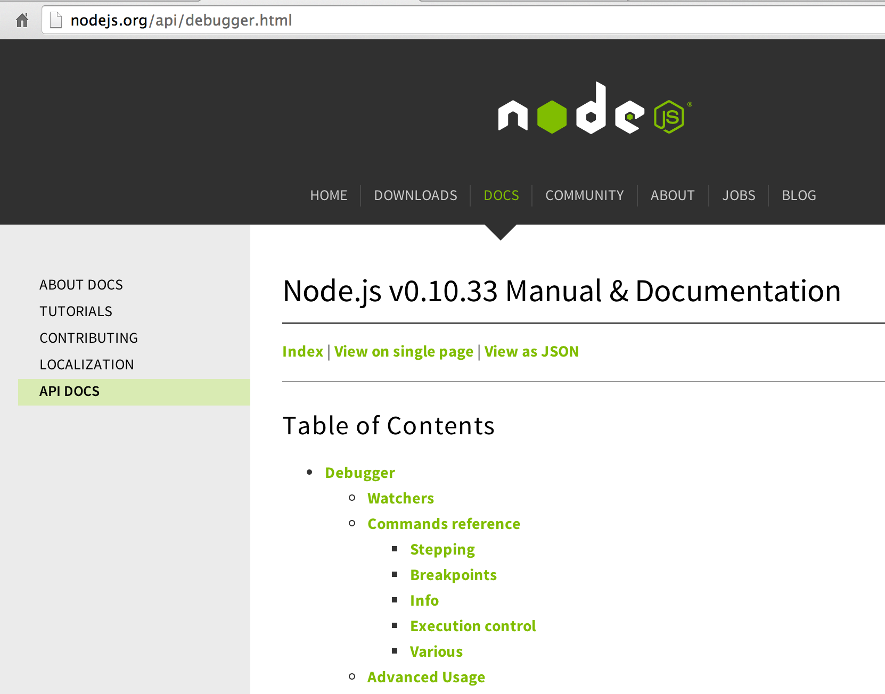
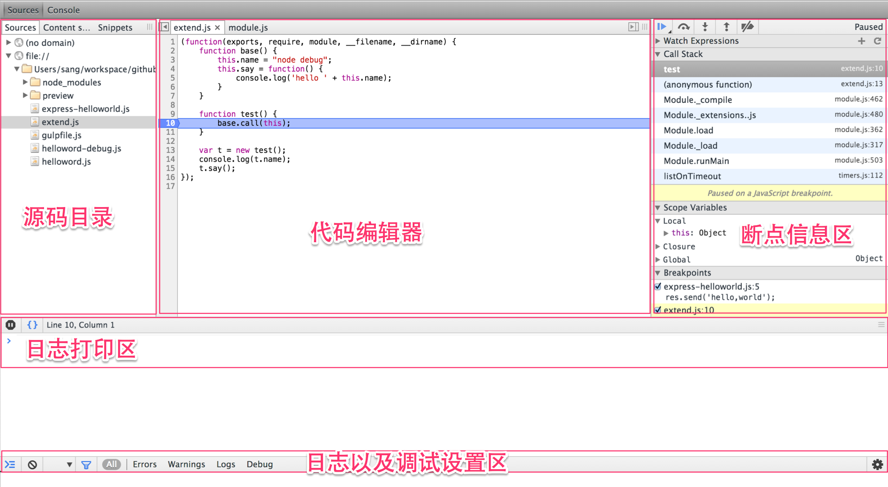
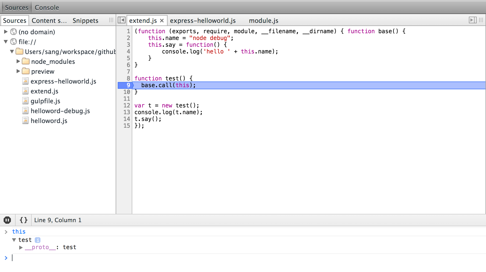
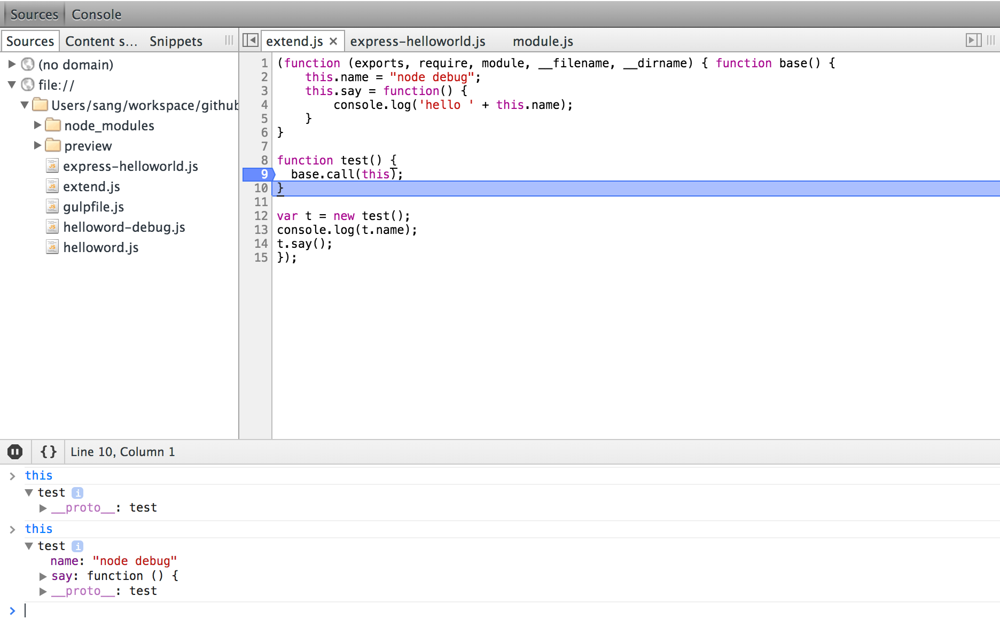
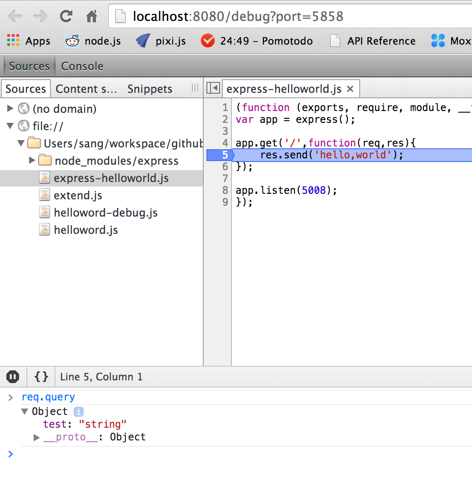
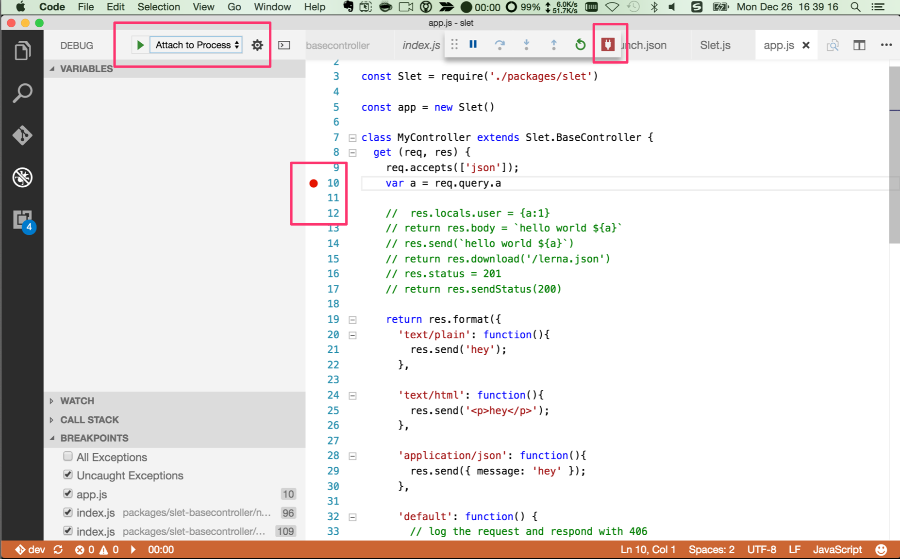
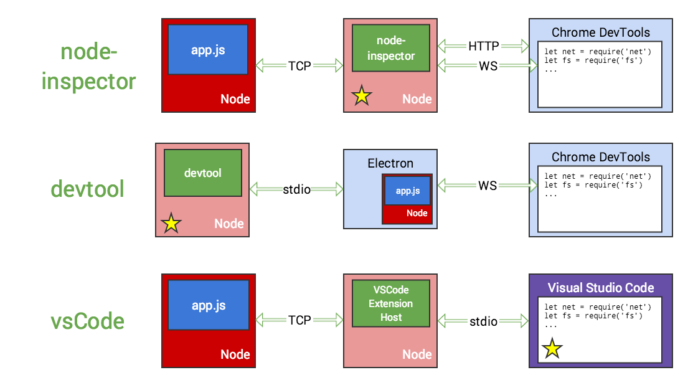
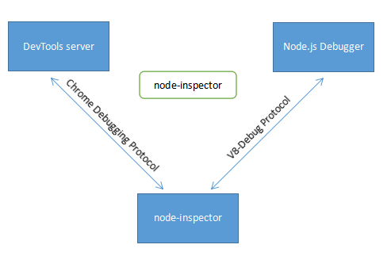
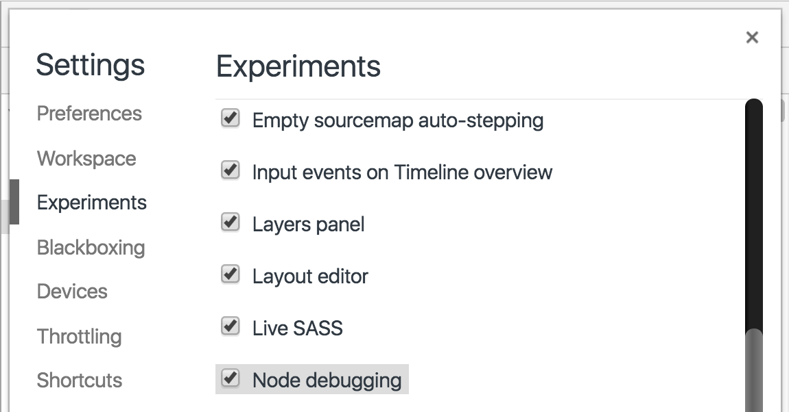
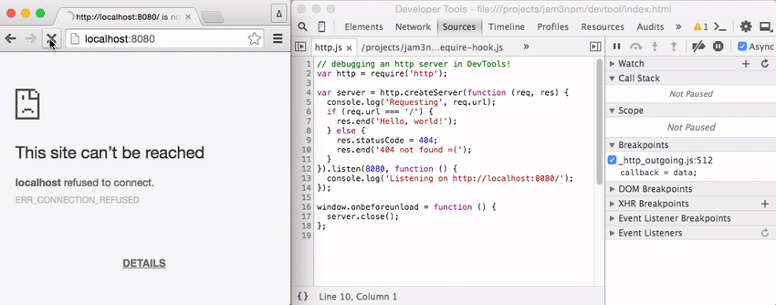

node-debug tutorial
===================

大家对nodejs调试应该都比较头疼，至少我这个不用IDE写js的人很头疼这个，其实node的生态圈非常好
有非常好的工具和非常潮的开发方式

这里总结了3法3例，希望能对大家有所帮助 

变成3种境界

- 打日志
- 断点调试 
- 测试驱动开发（tdd | bdd）

3种方法

- console.log
- 断点调试：node debugger 或node inspector 或vscode
- 测试驱动开发

3个例子

- hello world
- 继承例子
- express helloworld

2种模式

- 本地调试Launch Program
- 远程调试Attach to Process

# 打日志

了解console上的方法，比如dir等

虽然很low，但很实用

# 断点调试

中规中矩，对大部分程序员应该都是比较熟悉的。无论是chrome还是eclipse，还是idea、webstorm等，只要会一种，熟悉起来就非常容易。

## node debug

V8 提供了一个强大的调试器，可以通过 TCP 协议从外部访问。Nodejs提供了一个内建调试器来帮助开发者调试应用程序。想要开启调试器我们需要在代码中加入debugger标签，当Nodejs执行到debugger标签时会自动暂停（debugger标签相当于在代码中开启一个断点）。

### hello world例子

代码如下：

see `helloword-debug.js`

	var hello = 'hello';
	var world = 'nodejs';

	debugger;

	var hello_world = hello + ' ' + world;
	console.log(hello_world);
	

执行命令：`node debug helloword-debug.js` 就可以进入调试模式。

当然，首先需要在程序代码中手动添加中断debugger; ， 这样当以调试模式运行时，程序会自动中断，然后等候你调试，就像GDB一样，可以用help命令查看自己都可以使用哪些调试命令。

```
node-debug-tutorial git:(master) ✗ node debug helloword-debug.js
< debugger listening on port 5858
connecting... ok
break in helloword-debug.js:1
  1 var hello = 'hello';
  2 var world = 'nodejs';
  3 
debug> help
Commands: run (r), cont (c), next (n), step (s), out (o), backtrace (bt), setBreakpoint (sb), clearBreakpoint (cb),
watch, unwatch, watchers, repl, restart, kill, list, scripts, breakOnException, breakpoints, version
debug> 
debug> n
break in helloword-debug.js:2
  1 var hello = 'hello';
  2 var world = 'nodejs';
  3 
  4 debugger;
debug> repl
Press Ctrl + C to leave debug repl
> hello
'hello'
```

此时repl打开js上下文即时求值环境，和chrome的debug的console是一样的。


如果想退出，请按下`ctrl + c`,这样就可以返 到debug模式

```
debug> n
break in helloword-debug.js:4
  2 var world = 'nodejs';
  3 
  4 debugger;
  5 
  6 var hello_world = hello + ' ' + world;
debug> n
break in helloword-debug.js:6
  4 debugger;
  5 
  6 var hello_world = hello + ' ' + world;
  7 console.log(hello_world);
  8 
debug> n
break in helloword-debug.js:7
  5 
  6 var hello_world = hello + ' ' + world;
  7 console.log(hello_world);
  8 
  9 });
debug> repl
Press Ctrl + C to leave debug repl
> hello_world
'hello nodejs'
> 
end
```

如果想终止调试，请按下2次`ctrl + c`键

### 命令说明

| 可选项 | 用途    | 
|-------|------------| 
| run	| 执行脚本,在第一行暂停| 
| restart	| 重新执行脚本| 
| cont, c	| 继续执行,直到遇到下一个断点| 
| next, n	| 单步执行| 
| step, s	| 单步执行并进入函数| 
| out, o	| 从函数中步出| 
| setBreakpoint(), sb()	| 当前行设置断点| 
| setBreakpoint(‘f()’), sb(...)| 在函数f的第一行设置断点| 
| setBreakpoint(‘script.js’, 20), sb(...)| 在 script.js 的第20行设置断点| 
| clearBreakpoint, cb(...)| 清除所有断点| 
| backtrace, bt| 显示当前的调用栈| 
| list(5)| 显示当前执行到的前后5行代码| 
| watch(expr)| 把表达式 expr 加入监视列表| 
| unwatch(expr)|  把表达式 expr 从监视列表移除 | 
| watchers| 显示监视列表中所有的表达式和值| 
| repl| 在当前上下文打开即时求值环境| 
| kill| 终止当前执行的脚本| 
| scripts| 显示当前已加载的所有脚本| 
| version| 显示v8版本| 

这里就和gdb等调试器一模一样了


回归一下，debug的2种模式：

- js上下文即时求值环境模式
- debug断点模式

八卦一下啊，你了解vi的3种工作模式么？

- 普通(normal)模式，又称命令模式
- 插入(insert)模式
- 命令行(cmdline)模式

化用一下更容易理解

[node debugger官方文档](http://nodejs.org/api/debugger.html)



上面有更多的例子和api，有了上面的基础，学习会非常简单。

### FAQ

注意,如果出现

	< Failed to open socket on port 5858, waiting 1000 ms before retrying
	
请结束掉所有debug进程

	ps -ef|grep debug-brk|awk '{print $2}'|xargs kill -9

## node inspector


上面这种方式稍微有些麻烦，作为前端开发人员，我们写JS代码调试的时候一般都用FireBug或Chrome浏览器内置的调试工具，其实nodejs程序也可以这样子来调试，但是首先需要安装一个node-inspector的模块。

node-inspector是通过websocket方式来转向debug输入输出的。因此，我们在调试前要先启动node-inspector来监听Nodejs的debug调试端口。

### 安装

这个需要用npm来安装，只需要执行下列语句：

	npm install -g node-inspector
	
安装完成之后，通常可以直接这样启动在后台：

	node-inspector &
	
默认会监听8080端口，当然，也可能通过使用--web-port参数来修改。然后，在执行node程序的时候，多加个参数：--debug-brk, 如下：

	node --debug-brk app.js
	
或者

	node-debug app.js

控制台会返回“debugger listening on port 5858”， 现在打开浏览嚣，访问http://localhost:8080/debug?port=5858，这时候就会打开一个很像Chrome内置调试工具的界面，并且代码断点在第一行，下面就可以使用这个来调试了。

常用调试功能

- 增加断点，查看调用栈，变量等
- 使用console打印查看日志

使用方法和`chrome`的`inspect element`调试web开发是一样的。

调试还是很方便的，而且可以远程调试。其实原理很简单，它启动的是一个web server，我们要做的就是把localhost换成对应ip即可，要注意服务器的防火墙哦。

### 测试extend.js

测试一下继承是否ok，首先执行命令，打印出结果，但这种办法才挫了

```
➜  node-debug-tutorial git:(master) node extend.js 
node debug
hello node debug
```


开始使用node-inspector调试

#### 启动

```
➜  node-debug-tutorial git:(master) node-debug  extend.js
Node Inspector is now available from http://localhost:8080/debug?port=5858
Debugging `extend.js`

debugger listening on port 5858
```

#### 界面说明




mac系统大部分人都记不住这些按键，下面给出说明

| Symbol    | Key         | 
|:---------:|:-----------:|
|  &#8984;  | Command Key |
|  &#8963;  | Control Key |
|  &#8997;  | Option Key  |
|  &#8679;  | Shift Key   |


断点操作

- resume script execution（F8）
	挂起断点，也可以理解为放弃当前断点，如果有下一个断点，会自动断住得
- step over（F10）
	跳过这行，到下一行，如果当前函数结束，会跳到调用栈的上一级的下一行
- step into（F11）
	进入当前行代码里的函数内部
- step out（Shift + F11）
	从当前函数退出到之前进入的代码处


控制台操作

- 不能使用var，直接打印变量杰克

#### 增加断点，并打印出this



#### 断点下一步，并打印出this



#### 结论

通过

	base.call(this);
	
这行代码，明显看到test对象的this被改变了，即使test拥有了base的所有属性和方法，这是最简单的实现继承的方法，当然多重继承mixin也可以是这样的原理


### 测试express helloworld

这种测试一般都是看request里的params，query和body等

准备工作

	npm init .
	npm install --save express
	touch express-helloworld.js


测试express-helloworld.js代码

	var express = require('express');
	var app = express();

	app.get('/',function(req,res){
    	res.send('hello,world');
	});

	app.listen(5008);

执行,安装服务器自动重载模块

	npm install -g supervisor
	supervisor express-helloworld.js
	
打开浏览器访问http://127.0.0.1:5008/就会看到helloworld返回

此时终止`supervisor express-helloworld.js`,使用`ctrl + c`终止。

然后使用node-inspect调试

	➜  node-debug-tutorial git:(master) ✗ node-debug express-helloworld.js 
	Node Inspector is now available from http://localhost:8080/debug?port=5858
	Debugging `express-helloworld.js`

	debugger listening on port 5858

增加断点


使用curl来模拟get请求，增加一个参数test，便于一会的debug

```
curl -G -d "test=string" http://127.0.0.1:5008/
```
此时浏览器页面会停在断点处，在console里输入`req.query`即可以查到参数




## vscode

为什么选用vsc，一个原因就是因为调试

- node-inspector虽好，项目已大特别慢，这方面vsc做了不少优化
- tdd/bdd虽好，还不能完全实现

vsc官方说

```
We improved stepping performance by loading the scopes and variables 
of stack frames lazily. This improvement is based on a protocol change
that affects all debug adapters.
```

意思就是他们做了很多优化

使用中，确实比node-inspector快很多

vsc调试使用方法也很简单,步骤如下：

- 打开要调试的文件，按f5,编辑器会生成一个launch.json
- 修改launch.json相关内容，主要是name和program字段，改成和你项目对应的
- 点击编辑器左侧长得像蜘蛛的那个按钮
- 点击左上角DEBUG后面的按钮，启动调试
- 打断点，尽情调试（只要你会chrome调试，一模一样）


更多示例，参见https://github.com/i5ting/vsc

# 测试驱动开发

和断点调试思维相反，先写测试用例，知道自己要实现什么效果，再去写代码。所以不是很容易接受。而且一旦重构，就要重写测试，也是比较痛苦的。但测试对软件的稳定性和质量是至关重要的。所以一旦习惯测试，你会爱不释手。

- tdd
- bdd
- 代码覆盖率

### 测试框架

- nodeunit
- mocha
- ava
- jest

更多测试

	npm install --save-dev chai
	npm install --save-dev sinon
	npm install --save-dev supertest
	npm install --save-dev zombie
	
### chai

Should

```
chai.should();

foo.should.be.a('string');
foo.should.equal('bar');
foo.should.have.lengthOf(3);
tea.should.have.property('flavors')
  .with.lengthOf(3);
```

Expect

```
var expect = chai.expect;

expect(foo).to.be.a('string');
expect(foo).to.equal('bar');
expect(foo).to.have.lengthOf(3);
expect(tea).to.have.property('flavors')
  .with.lengthOf(3);
```

Assert

```
var assert = chai.assert;

assert.typeOf(foo, 'string');
assert.equal(foo, 'bar');
assert.lengthOf(foo, 3)
assert.property(tea, 'flavors');
assert.lengthOf(tea.flavors, 3);
```             

				
### sinon

JavaScript里的测试监视(spy)、桩(stub)和仿制(mock)功能. http://sinonjs.org/

```
function once(fn) {
    var returnValue, called = false;
    return function () {
        if (!called) {
            called = true;
            returnValue = fn.apply(this, arguments);
        }
        return returnValue;
    };
}
```

测试

```
it('calls the original function', function () {
    var callback = sinon.spy();
    var proxy = once(callback);

    proxy();

    assert(callback.called);
});
```


推荐

- http://jaketrent.com/post/sinon-spies-vs-stubs/ 推荐
- https://semaphoreci.com/community/tutorials/best-practices-for-spies-stubs-and-mocks-in-sinon-js


### supertest 

简化express项目测试

https://github.com/visionmedia/supertest


```
const request = require('supertest');
const express = require('express');

const app = express();

app.get('/user', function(req, res) {
  res.status(200).json({ name: 'tobi' });
});

request(app)
  .get('/user')
  .expect('Content-Type', /json/)
  .expect('Content-Length', '15')
  .expect(200)
  .end(function(err, res) {
    if (err) throw err;
  });
```

实现原理也非常简单，http.createServer可以去到port，传给supertest，解决了ip和端口，剩下就是path和参数等了，所以更简单、专注


### zombie

浏览器测试

Insanely fast, full-stack, headless browser testing using node.js http://zombie.js.org/


```
const Browser = require('zombie');

// We're going to make requests to http://example.com/signup
// Which will be routed to our test server localhost:3000
Browser.localhost('example.com', 3000);

describe('User visits signup page', function() {

  const browser = new Browser();

  before(function(done) {
    browser.visit('/signup', done);
  });

  describe('submits form', function() {

    before(function(done) {
      browser
        .fill('email',    'zombie@underworld.dead')
        .fill('password', 'eat-the-living')
        .pressButton('Sign Me Up!', done);
    });

    it('should be successful', function() {
      browser.assert.success();
    });

    it('should see welcome page', function() {
      browser.assert.text('title', 'Welcome To Brains Depot');
    });
  });
});
```


### Cucumber

用户故事：User Story。这是一个从属于产品设计的概念，它所指的，是从用户的角度来描述用户需求，要使用用户可以理解的业务预研来描述、切忌使用技术术语。

> As a role, I want goal/desire so that benefit.

即：

- 角色：谁
- 活动：需要做什么
- 价值：为什么

先定义features/documentation.feature文件

```
	# features/documentation.feature
	Feature: Example feature
	  As a user of Cucumber.js
	  I want to have documentation on Cucumber
	  So that I can concentrate on building awesome applications

	  Scenario: Reading documentation
	    Given I am on the Cucumber.js GitHub repository
	    When I click on "CLI"
	    Then I should see "Running specific features"
```

```
// features/support/world.js
require('chromedriver')
var seleniumWebdriver = require('selenium-webdriver');
var {defineSupportCode} = require('cucumber');

function CustomWorld() {
  this.driver = new seleniumWebdriver.Builder()
    .forBrowser('chrome')
    .build();
}

defineSupportCode(function({setWorldConstructor}) {
  setWorldConstructor(CustomWorld)
})
```

```
// features/step_definitions/hooks.js
var {defineSupportCode} = require('cucumber');

defineSupportCode(function({After}) {
  After(function() {
    return this.driver.quit();
  });
});
```


```
// features/step_definitions/browser_steps.js
var seleniumWebdriver = require('selenium-webdriver');
var {defineSupportCode} = require('cucumber');

defineSupportCode(function({Given, When, Then}) {
  Given('I am on the Cucumber.js GitHub repository', function() {
    return this.driver.get('https://github.com/cucumber/cucumber-js/tree/master');
  });

  When('I click on {stringInDoubleQuotes}', function (text) {
    return this.driver.findElement({linkText: text}).then(function(element) {
      return element.click();
    });
  });

  Then('I should see {stringInDoubleQuotes}', function (text) {
    var xpath = "//*[contains(text(),'" + text + "')]";
    var condition = seleniumWebdriver.until.elementLocated({xpath: xpath});
    return this.driver.wait(condition, 5000);
  });
});
```

如果不执行严格bdd，基本上用不到。https://github.com/cucumber/cucumber-js/

### 代码覆盖率

修改Gulpfile.js

- auto test
- 代码测试覆盖率

```
npm install --save-dev gulp
npm install --save-dev gulp-mocha
npm install --save-dev gulp-istanbul
```

创建gulpfilejs

```
var gulp = require('gulp');
var istanbul = require('gulp-istanbul');
var mocha = require('gulp-mocha'); 

gulp.task('test', function (cb) {
  gulp.src(['db/**/*.js'])
    .pipe(istanbul()) // Covering files
    .on('finish', function () {
      gulp.src(['test/*.js'])
        .pipe(mocha())
        .pipe(istanbul.writeReports()) // Creating the reports after tests runned
        .on('end', cb);
    });
});

gulp.task('default',['test'], function() {
  gulp.watch(['./db/**/*','./test/**/*'], ['test']);
});

gulp.task('watch',['test'], function() {
  gulp.watch(['./db/**/*','./test/**/*'], ['test']);
});
```

测试

node_modules/.bin/gulp 
这时，你试试修改测试或源文件试试，看看会不会自动触发测试

当然，如果你喜欢只是测试一次，可以这样做

node_modules/.bin/gulp test 
如果你不熟悉gulp，可以再这里https://github.com/i5ting/js-tools-best-practice/blob/master/doc/Gulp.md学习

修改package.json

```
  "scripts": {
    "start": "./node_modules/.bin/supervisor ./bin/www",
    "test": "./node_modules/.bin/mocha -u tdd"
  },
```		

# 2种模式

## 本地调试Launch Program

简单说，就是直接执行，上文最简单的断点调试都属于这种模式

举例说明单个文件调试，尤其重要

## 远程调试Attach to Process

简单说，是调试某个已启动的线程

比如，我在终端里，node --debug启动了某个程序，

```
node --debug app.js
Debugger listening on 127.0.0.1:5858
```

这样就启动了debugger，然后你就可以在vscode或者node inspector里attach里



# 原理

## 架构


## 举例



```
let vm = require('vm')
let debug = vm.runInDebugContext('Debug')

function test() {}

debug.setListener((event, execState, eventData, data) => {
    if (event != debug.DebugEvent.Break) return

    var script   = eventData.func().script().name()
    var line     = eventData.sourceLine()
    var col      = eventData.sourceColumn()

    var location = script + ":" + line + ":" + col

    var funcName = eventData.func().name()
    if (funcName != "") {
        location += " " + funcName + "()"
    }

    console.log(location)
})

debug.setBreakPoint(test, 0, 0)

test()
// /Users/sang/workspace/github/node-debug-tutorial/a.js:3:17 test()
```

## 内置的Node.js Debugger

> Node.js includes a full-featured out-of-process debugging utility accessible via a simple TCP-based protocol and built-in debugging client.

To start the built-in debugger you have to start your application this way:

> node debug app.js 


## Chrome Debugger

> v8-inspector protocol is available in node 6.3+ and enables debugging & profiling of Node.js apps.

2016年5月份，谷歌工程师 ofrobots 提交了一个Add v8_inspector support的PR。同时在5月份的 DevTools Google I/O talk (Youtube视频，需翻墙) 有提到此功能。

就是说 v8_inspector 可以让 DevTools 直接连接 Node.js的Debugger进行调试。

现如今，新版本的Chrome浏览器和新版本的Node.js支持通过一个新的调试协议能互相直接通讯了，就不再需要node-inspector了。

版本支持

- Node.js 6.3+
- Chrome 55+

## 不在使用的node-inspector模块



## VSCode配置

launch.json里有2种关于调试的配置

- 通过旧版本协议附加（node debug），Node.js 6.3-
- 通过检查器协议附加（v8-inspector），版本依赖是Node.js 6.3+

```
       {
            "type": "node",
            "request": "attach",
            "name": "Attach (Inspector Protocol)",
            "port": 9229,
            "protocol": "inspector"
        },
        {
            "type": "node",
            "request": "attach",
            "name": "Attach (Legacy Protocol)",
            "port": 5858,
            "protocol": "legacy"
        },
```

通过这个我们也可能看出调试协议的变化


# Other


## Chrome DevTools

要求

- 1) Node.js 6.3+
- 2) Chrome 55+

步骤

- 开启chrome://flags/#enable-devtools-experiments URL
- 启动 Developer Tools experiments flag
- 重启 Chrome
- 打开 DevTools Setting -> Experiments tab (重启之后的才能看见)
- 按下 "SHIFT" 6 次
- 选中 "Node debugging" 复选框
- 打开/关闭 DevTools



https://blog.hospodarets.com/nodejs-debugging-in-chrome-devtools

## devtool

另外推荐一个electron包装的devtool，也非常好

https://github.com/Jam3/devtool



https://mattdesl.svbtle.com/debugging-nodejs-in-chrome-devtools

## debug模块

> DEBUG=express* node app.js  


## 资源

- [debugger官方文档](http://nodejs.org/api/debugger.html)
- [node-inspector仓库地址](https://github.com/node-inspector/node-inspector)

- [nodeunit](https://github.com/caolan/nodeunit)
- [mocha](https://github.com/mochajs/mocha)

- https://github.com/baryon/tracer
- http://www.habdas.org/node-js-debugging-primer/

- https://github.com/visionmedia/mocha
- http://visionmedia.github.io/mocha/
- http://mochajs.org/
- https://github.com/chaijs/chai
- http://chaijs.com/
- http://sinonjs.org/
- http://zombie.labnotes.org/
- https://github.com/tj/supertest（api test文档）
- https://github.com/tj/superagent/blob/master/test/node/agency.js（api test示例）
- https://github.com/i5ting/js-tools-best-practice/blob/master/doc/Gulp.md
- https://github.com/SBoudrias/gulp-istanbul

